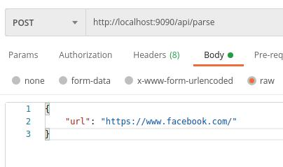

# HTML Parser Challenge

## Introduction

HTML Parser is capable of analysing the HTML content of a website and return an analysis result for that same page inluding the following:

- HTML Version
- Title of the website
- Number of headings by depth level
- Number of internal links (links to same domain)
- Number of external links (links to different domains)
- Number of inacccessible links (broken links or websites that aren't responding correly)
- If the website contains a login form

## Quick Start

### Run the server

To run the html parser server it is needed to do the following:

- Make sure you have [docker installed](https://docs.docker.com/engine/install/)
- Have [docker-compose installed](https://docs.docker.com/compose/install/) (optional)
- Download the repository into your machine and change directory into it

#### With docker-compose

- Simply run `docker-compose up`

#### With docker

- Run `docker build -t htmlparser .`
- Run `docker run --publish 9090:9090 --name htmlparser htmlparser`

### Make requests

To make a request to the server:

- Open your platform of choice to make API requests, for example [Postman](https://www.postman.com/).
- Make a POST request to `localhost:9090/api/parse` with a body containing an url as shown below



- Or using curl:

``` bash
curl -X POST -H "Content-Type: application/json" \
 -d '{"url": "https://facebook.com"}' \
 localhost:9090/api/parse
```

## Improvements

- Shorten response time (using a better caching technique)
